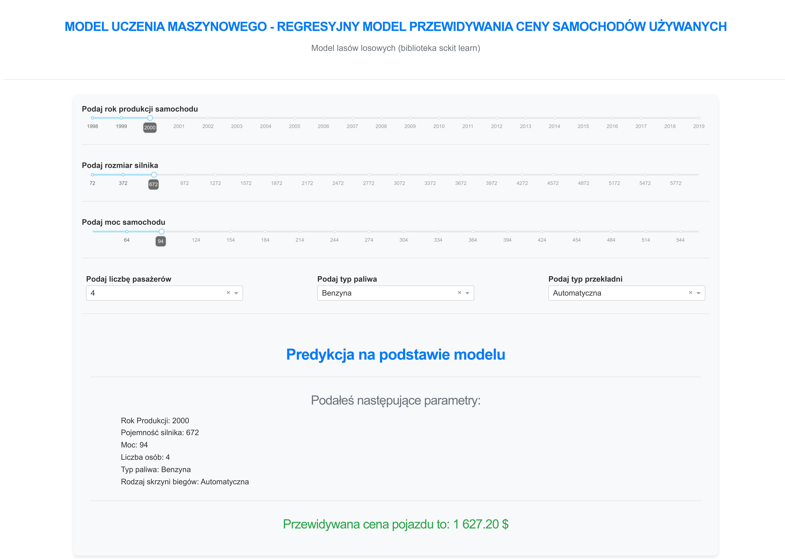

# Car Price Prediction App

## Overview
This project is a machine learning-based web application designed to predict the prices of used cars. The project utilizes a dataset from Kaggle containing various car features and their respective prices. The model was developed using the Scikit-Learn library and deployed as an interactive web application using Plotly Dash.

## Features
- **Machine Learning Model:** The model is a Random Forest Regressor, fine-tuned using Grid Search, to predict car prices based on features such as year of manufacture, engine size, power, number of seats, fuel type, and transmission type.
- **Interactive Web Application:** The web app provides a user-friendly interface where users can input car details and get an estimated price prediction in real-time.

## Project Structure
- `build_model.py`: Script used to clean the dataset, train the machine learning model, and save the model using Pickle.
- `callbacks.py`: Contains the callback functions for the Dash app, which handle the interaction logic and predictions based on user inputs.
- `app.py`: Main script to run the Dash application. It loads the trained model and sets up the layout and components of the web app.

## Sample Data
Below is a sample of the dataset used to train the model:

| Name                              | Location   | Year | Kilometers_Driven | Fuel_Type | Transmission | Owner_Type | Mileage   | Engine  | Power   | Seats | New_Price | Price |
|-----------------------------------|------------|------|-------------------|-----------|--------------|------------|-----------|---------|---------|-------|-----------|-------|
| Maruti Wagon R LXI CNG            | Mumbai     | 2010 | 72000             | CNG       | Manual       | First      | 26.6 km/kg| 998 CC  | 58.16 bhp| 5.0   |           | 1.75  |
| Hyundai Creta 1.6 CRDi SX Option  | Pune       | 2015 | 41000             | Diesel    | Manual       | First      | 19.67 kmpl| 1582 CC | 126.2 bhp| 5.0   |           | 12.5  |
| Honda Jazz V                      | Chennai    | 2011 | 46000             | Petrol    | Manual       | First      | 18.2 kmpl | 1199 CC | 88.7 bhp | 5.0   | 8.61 Lakh | 4.5   |
| Maruti Ertiga VDI                 | Chennai    | 2012 | 87000             | Diesel    | Manual       | First      | 20.77 kmpl| 1248 CC | 88.76 bhp| 7.0   |           | 6.0   |
| Audi A4 New 2.0 TDI Multitronic   | Coimbatore | 2013 | 40670             | Diesel    | Automatic    | Second     | 15.2 kmpl | 1968 CC | 140.8 bhp| 5.0   |           | 17.74 |

## Application Preview
Below is a preview of the application interface:



## Installation
To run the project locally, follow these steps:

1. Clone the repository:
    ```bash
    git clone https://github.com/your-username/car-price-prediction.git
    ```
2. Create a virtual environment and activate it:
    ```bash
    python -m venv venv
    source venv/bin/activate  # On Windows use `venv\Scripts\activate`
    ```
3. Install the required packages:
    ```bash
    pip install -r requirements.txt
    ```
4. Run the Dash app:
    ```bash
    python app.py
    ```
5. Open your browser and navigate to `http://127.0.0.1:8050/` to view the app.

## Usage
1. Adjust the sliders and dropdowns in the app to match the specifications of the car you want to evaluate.
2. The app will display the predicted price based on the input parameters.

## Dataset
The dataset used for training the model can be found on Kaggle [here](https://www.kaggle.com/username/dataset). It includes various features such as the year of manufacture, engine size, power, and more.

## Model
The model is a Random Forest Regressor from the Scikit-Learn library, trained on a cleaned version of the dataset with features such as `Year`, `Engine`, `Power`, `Seats`, `Fuel_Type`, and `Transmission`.

## Future Improvements
- Enhance the model's accuracy by incorporating more features or trying different machine learning algorithms.
- Deploy the app to a cloud platform like Heroku for easier access.
- Add more interactive visualizations to help users better understand the predictions.
